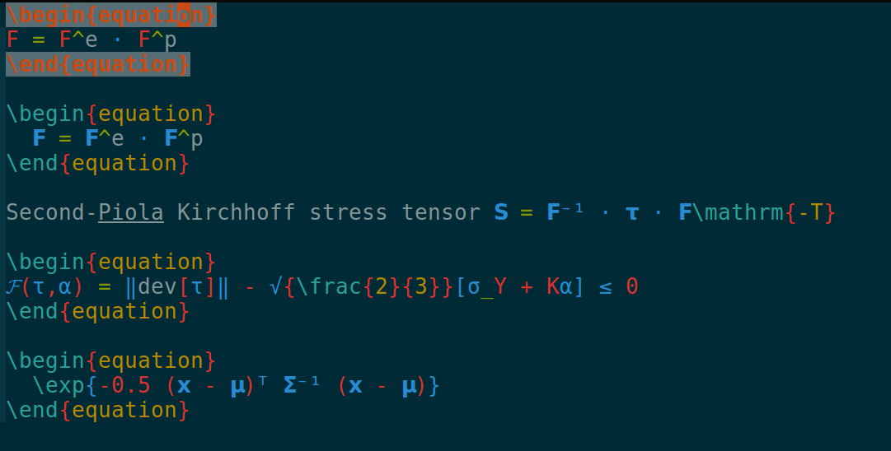

# vim-tex-conceal

Fork of [tex-conceal.vim](https://github.com/KeitaNakamura/tex-conceal.vim)

This plugin extends the Conceal feature of Vim for LaTeX.

To install, you can use e.g.
[Vundle](https://github.com/VundleVim/Vundle.vim) with

    Plugin 'shiandy/vim-tex-conceal'

# How to use

1. Use the macros defined in the `macros.tex` file to typeset your
   LaTeX file.
2. When this plugin is active, vim will replace the tex code with the
   appropriate symbol. We defined more symbols to replace more tex code
   that was defined via our macros.


# Results

## Without conceal


## With conceal


## With conceal and this plugin




## Recommend settings
```vim:~/.vimrc
set conceallevel=2
let g:tex_conceal="abdgms"
```
